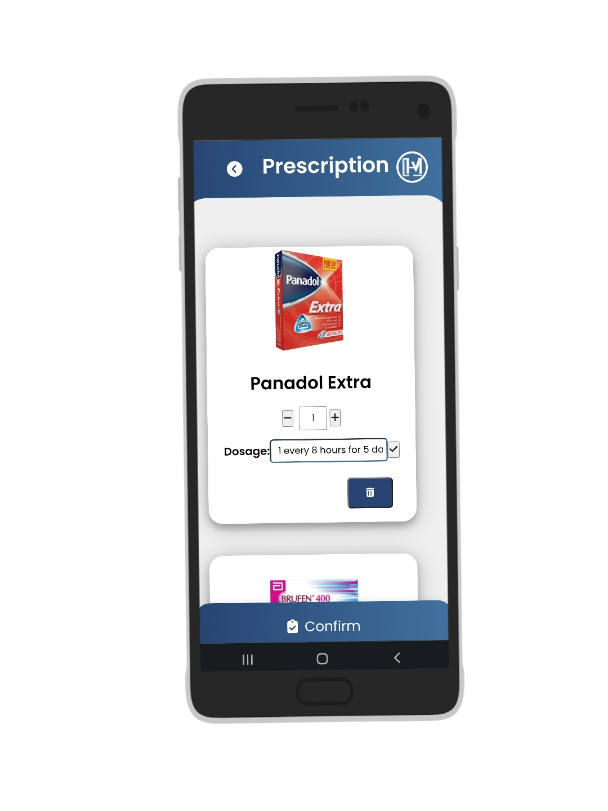
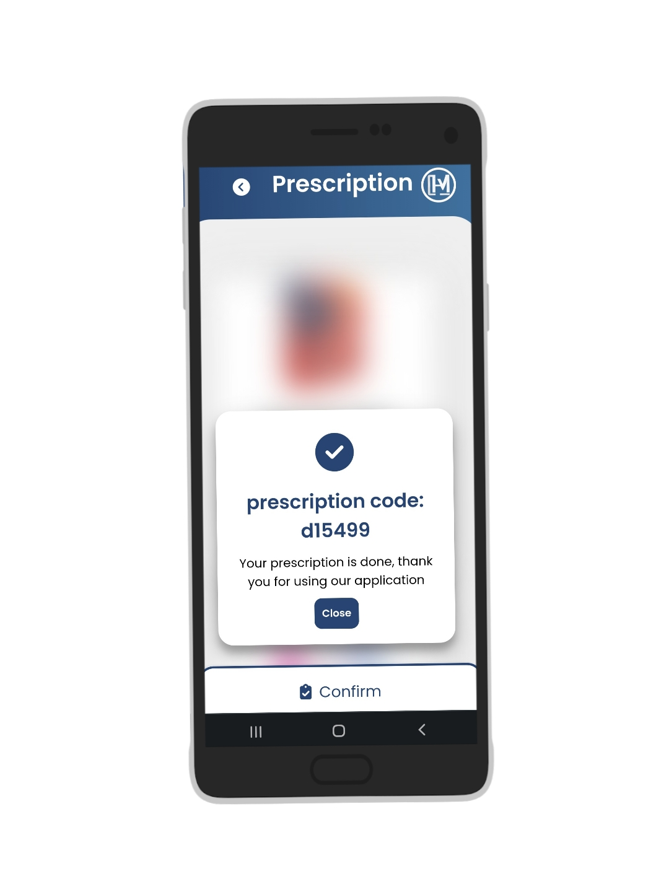
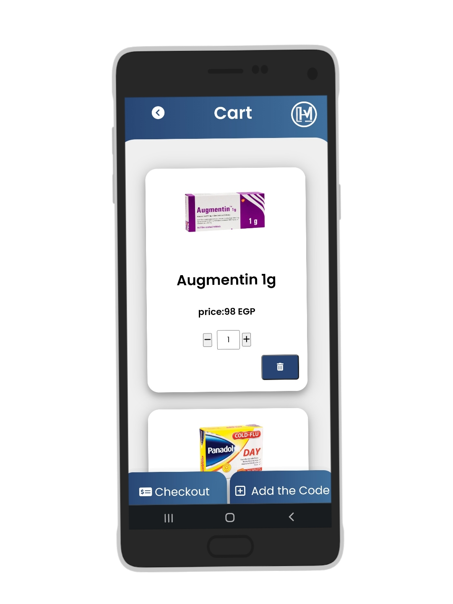
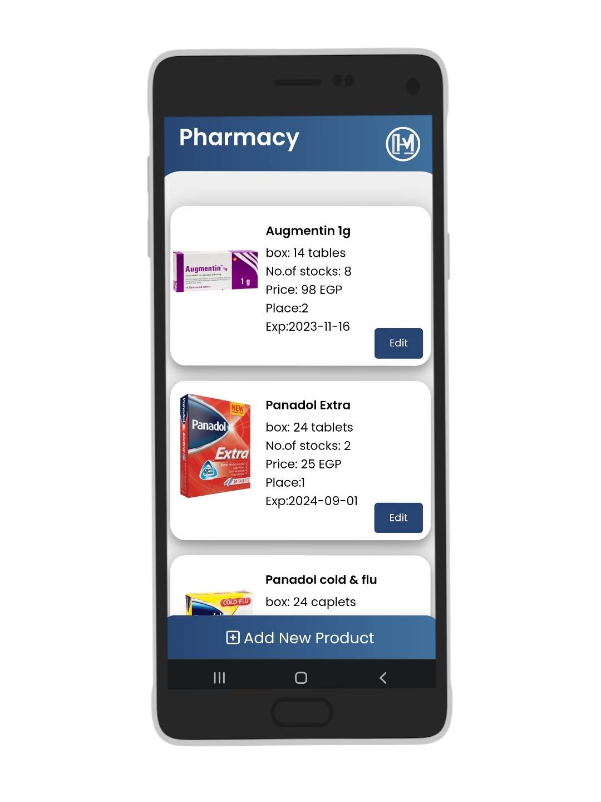
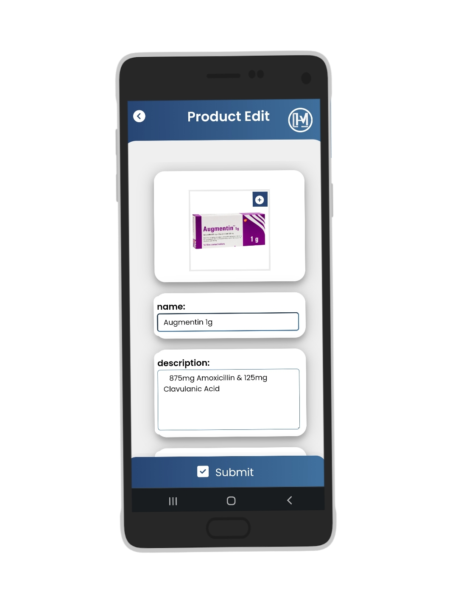

# Smart_Pharmacy_Vending_Machine_App
web application for doctors, patients, and the admin to utilize our pharmacy vending machine

## Table of Contents

- [Introduction](#introduction)
- [Features](#features)
- [Usage](#usage)
- [Implementation](#Implementation)
- [Screen shots](#screen-shots)

## Introduction

Welcome to the Pharmacy Vending Machine Application repository! This web application is designed to streamline the process of accessing medicines and products from a vending machine for both doctors and patients. It offers a user-friendly interface, prescription management, and admin controls for efficient inventory management.

## Features

- **Doctor's Portal:**
  - Create prescriptions with accurate dosage information.
  - Generate unique six-character codes for prescriptions to minimize errors.

- **Patient's Portal:**
  - Access the application via a QR code from the vending machine.
  - Browse a user-friendly marketplace.
  - Add products and prescriptions to the cart.
  - View dosage information for added prescriptions.

- **Admin Panel:**
  - Manage the product database:
    - Add new products.
    - Edit existing product details (e.g., location, price, expiration date).
  - Monitor inventory and vending machine status.

 ## Usage
 -Doctors can log in to the application to create prescriptions and obtain unique codes for patients.
 -Patients can access the application by scanning the QR code from the vending machine to order medicines and products.
 -Admins can manage the product database, add new products, and edit existing product information via the admin panel.

 ## Implementation
The backend of the Pharmacy Vending Machine Application was meticulously developed using PHP and MySQL to ensure robust functionality and secure data management. PHP, a widely-used server-side scripting language, provided the foundation for handling dynamic content generation and server-side logic. MySQL, a powerful relational database management system, was employed to efficiently store and manage data related to prescriptions, products, users, and inventory.

 ## Screen shots

